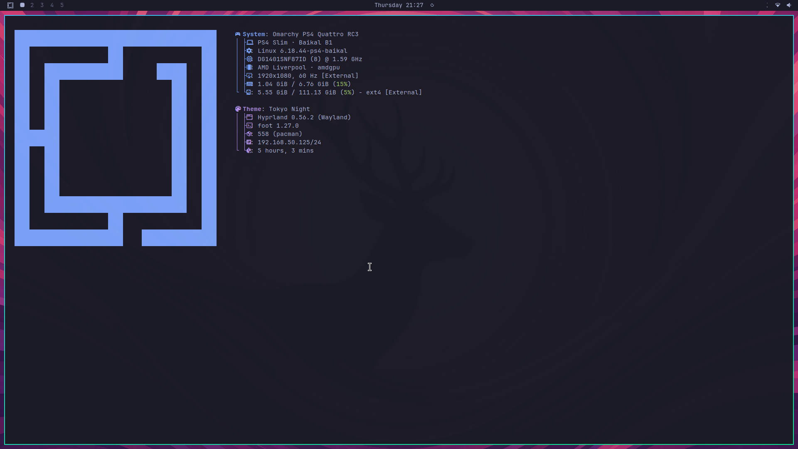
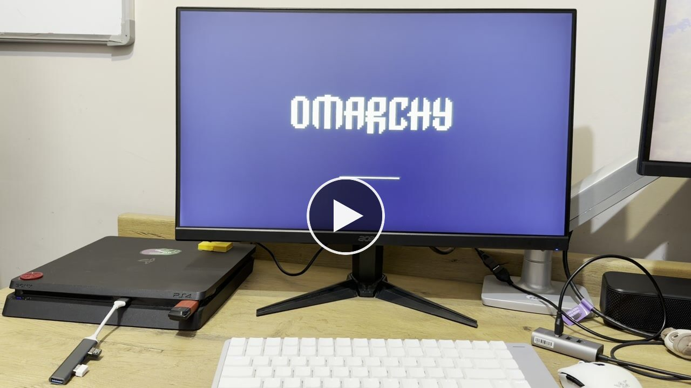

# Omarchy PS4

Omarchy Linux on a jailbroken PS4. A small PS4 application installs and boots
the kernel; the desktop lives on a separate USB drive.

*Cold boot to desktop on the Baikal B1 console — [watch on x.com](https://x.com/meerzulee/status/2091577507393004018).*

Hardware-development beta. One console verified: PS4 Slim, Baikal B1.

## Download

[**v0.31 — Baikal beta**](https://github.com/meerzulee/omarchy-ps4/releases/tag/v0.31-baikal-beta)
· unsigned · `omarchy-ps4-v0.31-baikal-beta.pkg`, 20,905,984 bytes,
`138ab7d05162ff4bb67faddcc1a9576a0f22dc13810f2ead5a2293b32467c6a3`

Kernel source and builds:
[`meerzulee/linux-ps4`](https://github.com/meerzulee/linux-ps4)
· [`v6.18.44-ps4-baikal-r1`](https://github.com/meerzulee/linux-ps4/releases/tag/v6.18.44-ps4-baikal-r1)

The USB root filesystem is not published yet. See
[the release notes](docs/releases/v0.31-baikal-beta.md#publication).

## Requirements

- PS4 Slim, Baikal B1 southbridge, jailbroken with GoldHEN
- one USB drive, flashed whole-device as ext4 labelled `OMARCHY-PS4`
- a UART cable for development work

Other southbridges and firmware combinations are unverified.

## Start here

[`docs/GETTING-STARTED.md`](docs/GETTING-STARTED.md) — jailbreak, USB, package,
first boot, owner setup.

## Stack

Linux 6.18.44 · Hyprland on Wayland · UWSM · Quickshell · Omarchy 4.0.0 ·
1920×1080@60 · 1024 MB VRAM · XFCE as the recovery desktop.

## Open

- persistent autologin, pending a bounded reboot pass on a rebuilt image
- network-time persistence, pending the same
- release signing
- repeated cold-boot acceptance

## Documentation

| | |
| --- | --- |
| [`docs/GETTING-STARTED.md`](docs/GETTING-STARTED.md) | install and first boot |
| [`docs/BUILDING.md`](docs/BUILDING.md) | reproducible build sequence |
| [`docs/PLAN.md`](docs/PLAN.md) | gate-driven roadmap |
| [`docs/CHECKPOINT-2026-08-22.md`](docs/CHECKPOINT-2026-08-22.md) | current state and resume plan |
| [`docs/COMPATIBILITY.md`](docs/COMPATIBILITY.md) | what is claimed and on what evidence |
| [`docs/PS4-FIXES.md`](docs/PS4-FIXES.md) | PS4-specific patches |
| [`docs/DEVELOPMENT-MODE.md`](docs/DEVELOPMENT-MODE.md) | hardware experiment rules |
| [`experiments/SESSIONS.md`](experiments/SESSIONS.md) | UART experiment record |
| [`fpkg/README.md`](fpkg/README.md) | the PS4 application |
| [`docs/ARCHITECTURE-RESEARCH.md`](docs/ARCHITECTURE-RESEARCH.md) | original design research |

## Licensing

Omarchy is MIT. The kernel is GPL-2.0-only and binary releases ship with
corresponding source. Bundled userland keeps its own licenses. No Sony firmware
is redistributed; the kexec path extracts Radeon firmware from the running
Orbis OS at boot. Third-party inputs and their status:
[`fpkg/THIRD_PARTY.md`](fpkg/THIRD_PARTY.md),
[`fpkg/CREDITS.md`](fpkg/CREDITS.md).

Not affiliated with Sony Interactive Entertainment. Not a jailbreak, and not a
production distribution.
